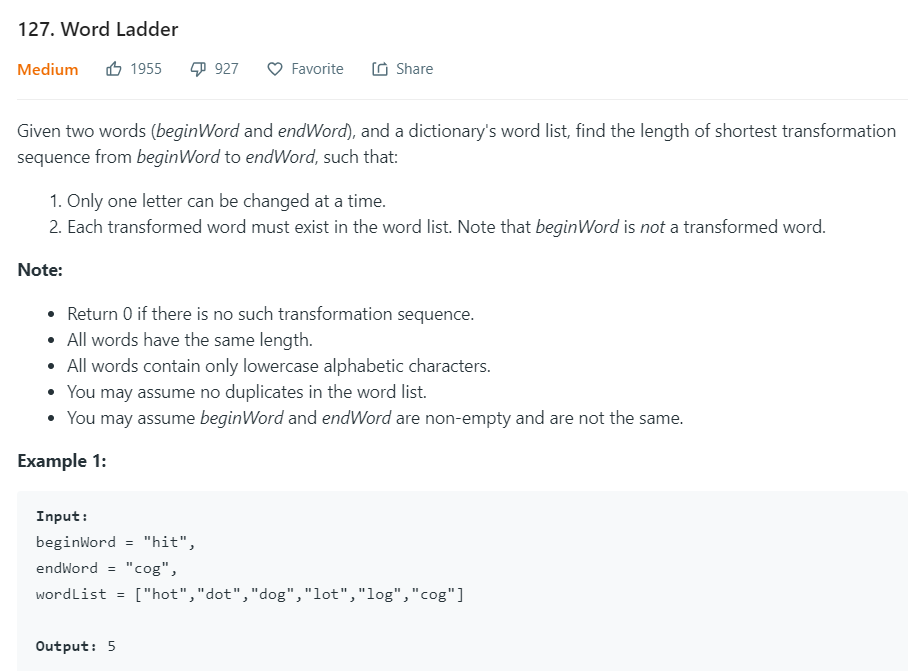
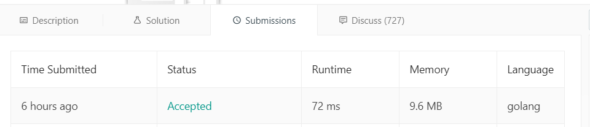
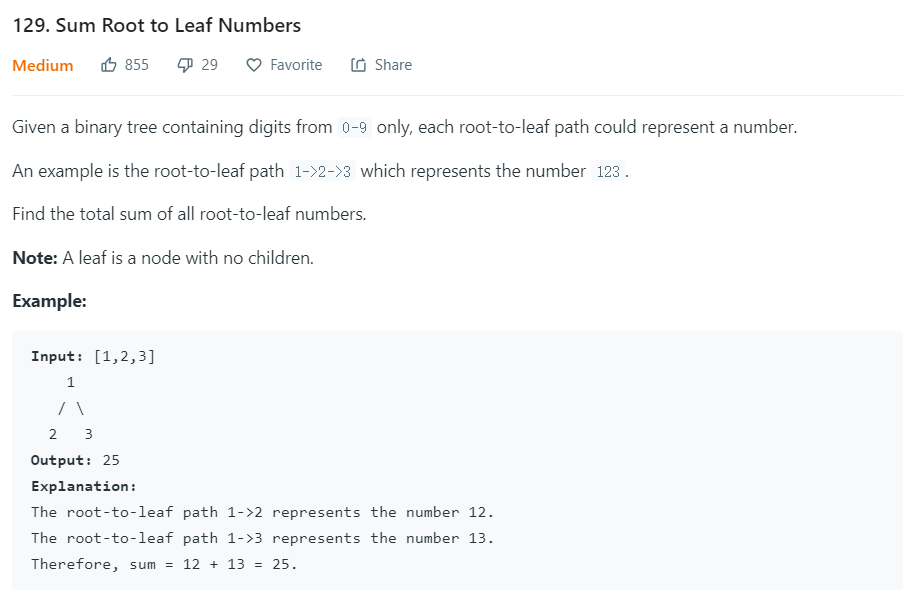
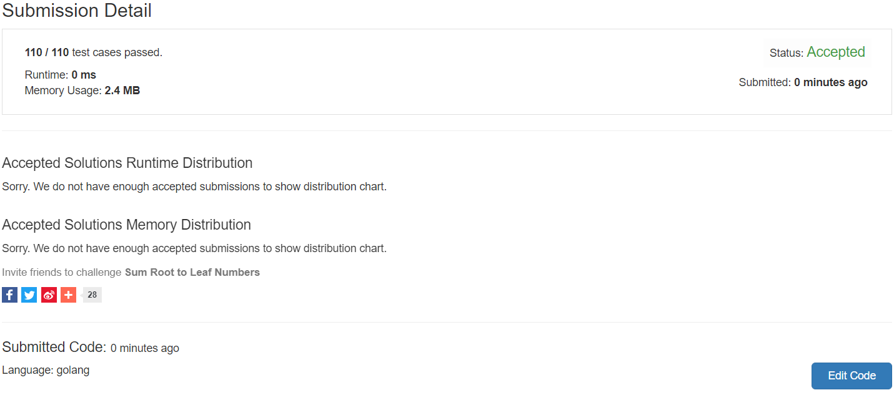

# Go算法题报告

## 2019年10月28日-2019年10月31日

### LeetCode127



这个题目思路很直观，就是BFS即可。但是直接BFS会发现：寻找和一个单词编辑距离为1的单词需要遍历wordList，并且还每次都需要遍历每个单词，这个开销非常大。

因此查看解答，发现它用了一个比较巧妙的预处理方式，采用辅助节点，比如`hot`，添加辅助节点`*ot`, `h*t`, `ho*`，用map存储它们能匹配的所有单词——比如`*ot`会存储`hot`和`dot`，而不是存储和`hot`编辑距离为1的单词，比如`hot`->`dog`，`dog`->`hot`，这种预处理方式是O($n^2L$)的复杂度，而采用辅助节点复杂度则是O($nL$)。

做BFS需要发现邻近节点可以多考虑，降低复杂度。

预处理代码如下：

```go
	length := len(beginWord)
	// Pre-Processing
	wordNodes := make(map[string]*list.List)
	for _, word := range wordList {
		for i := 0; i < length; i++ {
			wordNode := word[:i] + "*" + word[i + 1:]
			if wordNodeList, ok := wordNodes[wordNode]; ok {
				wordNodeList.PushBack(word)
			} else {
				wordNodes[wordNode] = list.New()
				wordNodes[wordNode].PushBack(word)
			}
		}
	}
```

整个代码如下，利用BFS和level来搞这道题：

```go
type Pair struct {
	value string
	level int
}

func ladderLength(beginWord string, endWord string, wordList []string) int {
	length := len(beginWord)
	// Pre-Processing
	wordNodes := make(map[string]*list.List)
	for _, word := range wordList {
		for i := 0; i < length; i++ {
			wordNode := word[:i] + "*" + word[i + 1:]
			if wordNodeList, ok := wordNodes[wordNode]; ok {
				wordNodeList.PushBack(word)
			} else {
				wordNodes[wordNode] = list.New()
				wordNodes[wordNode].PushBack(word)
			}
		}
	}

	// Queue
	queue := list.New()
	queue.PushBack(&Pair{beginWord, 1})
	visit := make(map[string]bool)
	for queue.Len() != 0 {
		elem := queue.Front()
		pair := elem.Value.(*Pair)
		queue.Remove(elem)
		word := pair.value
		level := pair.level
		if word == endWord {
			return level
		}
		if _, ok := visit[word]; ok {
			continue
		} else {
			visit[word] = true
		}

		for i := 0; i < length; i++ {
			wordNode := word[:i] + "*" + word[i + 1:]
			if wordNodeList, ok := wordNodes[wordNode]; ok {
				for listIter := wordNodeList.Front(); listIter != nil; listIter = listIter.Next() {
					nextWord := listIter.Value.(string)
					if _, ok := visit[nextWord]; ok {
						continue
					}
					queue.PushBack(&Pair{nextWord, level + 1})
				}
			}
		}
	}
	return 0
}
```

结果如图


### LeetCode129



这题用python写并不太难，但是不够优雅。简单的思路就是DFS，用一个函数，函数接受两个参数，第一个参数是根节点，第二个参数是累计值，每次把累计值×10再加上当前根节点的值就得到下次搜索需要的累计值，但是最后需要把累计值加到全局变量sum上，全局变量的出现会导致程序不够优雅。

用go写这个比较难想，不使用全局变量，优雅地解决这道题，需要使用函数对象和匿名函数！代码还是很清晰的，直接看代码即可。

```go
/**
 * Definition for a binary tree node.
 * type TreeNode struct {
 *     Val int
 *     Left *TreeNode
 *     Right *TreeNode
 * }
 */
func sumNumbers(root *TreeNode) int {
	sum := 0
	var helper func(*TreeNode, int)
	helper = func (root *TreeNode, acc int) {
		if root == nil {
			return
		}
		curAcc := acc * 10 + root.Val
		if (root.Left == nil) && (root.Right == nil) {
			sum += curAcc
			return
		}
		if root.Left != nil {
			helper(root.Left, curAcc)
		}
		if root.Right != nil {
			helper(root.Right, curAcc)
		}
	}
	helper(root, 0)
	return sum
}
```

这题没有几个人用go写，LeetCode统计都不好统计……

