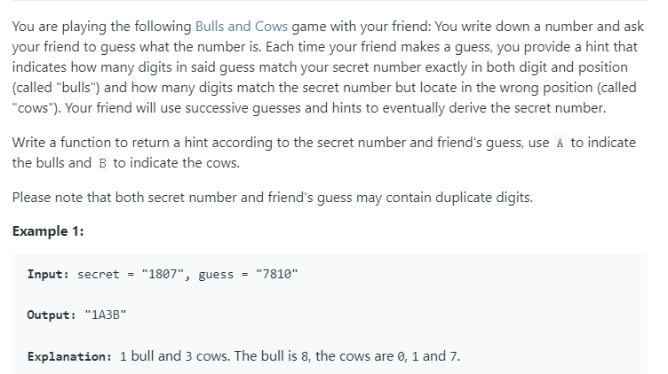
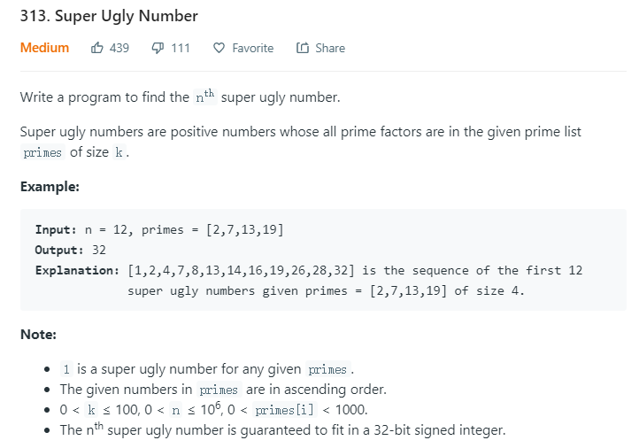

## 2019.10.27 - 2019.11.02
### Leetcode 299. Bulls and Cows


Go代码实现如下：
```go
func getHint(secret string, guess string) string {
    b := 0
    c := 0
	tmp := make([]int, 10)
    for i := 0; i < len(secret); i++ {
        s := secret[i] - '0'
        g := guess[i] - '0'
        if s == g {
            b++
            continue
        }
        if tmp[s] < 0 {
            c++
        }
        if tmp[g] > 0 {
            c++
        }
        tmp[s]++
        tmp[g]--
    }
    return fmt.Sprintf("%dA%dB", b, c)
}
```

### Leetcode 313. Super Ugly Number

Go代码实现如下：
```go
func nthSuperUglyNumber(n int, primes []int) int {
    if n==1{
        return 1
    }
    var results []int
    start:=make([]int,len(primes))
    to_be:=make([]int,len(primes))
    for i:=0;i<len(primes);i++{
        to_be[i]=primes[i]
    }
    results=append(results,1) 
    for k:=1;k<n;k++{
        results=append(results,min(to_be))
        for i:=0;i<len(primes);i++{
            if results[len(results)-1]==to_be[i]{
                start[i]++
                to_be[i]=results[start[i]]*primes[i]
            }
        }
    }
    return results[len(results)-1]
}
func min(to_be []int)int{
    minn:=to_be[0]
    for i:=0;i<len(to_be);i++{
        if minn>to_be[i]{
            minn=to_be[i]
        }
    }
    return minn
}
```