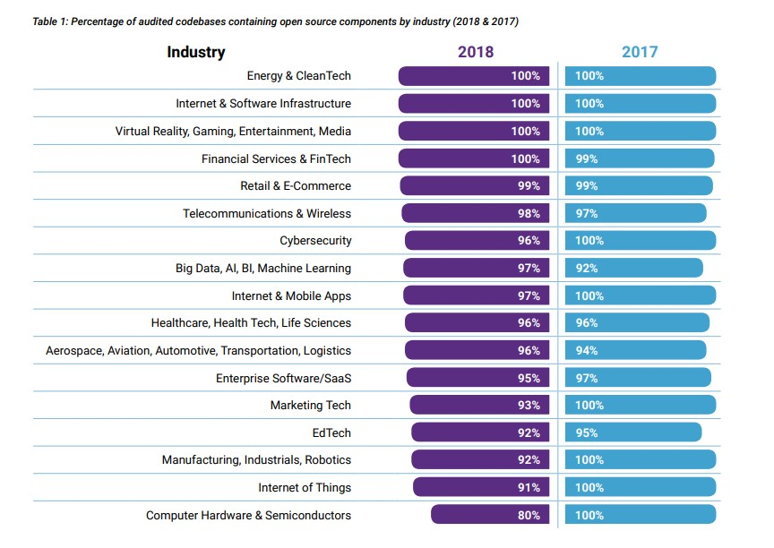
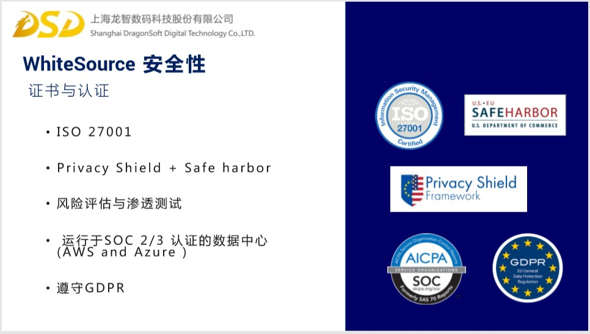

开源组件的健康扫描 调查报告
1. 项目的重要性和必要性（我们要解决的问题）
2. 项目要实现的功能（预期）
3. 项目的发展阶段（怎么解决）
4. 相关说明

[Equifax数据泄露事件始末](https://www.freebuf.com/news/148042.html)
1. 项目的重要性和必要性（我们要解决的问题）

[开源软件安全：优势与挑战共存](https://www.aqniu.com/news-views/32752.html)

- 免费开源代码漏洞扫描服务 Coverity Scan 扫描的7.5亿行开源代码中检出了110万个缺陷，其中65万个已经得到了解决。没解决的有哪些？ 如果开源的规模更巨大呢？Linux基金会报告称，开源代码库中提交的代码有310亿行。

- 解决了的，自己的项目有更新吗？可以更新吗？开源项目的更新并不会主动推送。Equifax数据泄露事件就是该问题的明显案例。其所用 Apache Struts 开源组件的补丁早在数据泄露发生前2个月就推出了，且Equifax也注意到了有补丁可用，但依然没能及时打上补丁。

- GitHub上排名前40万的公共代码库中，仅2.4%有安全文档。那些没有的可以用吗？

不仅开发人员会在应用更新过程中引入新的带漏洞的库，之前被认为安全的老库也会曝出新漏洞。软件不是像酒一样越久越醇，而是像牛奶一样一放就坏。

也许，你会觉得17年的数据，现在可能会有好转，那么我们看下18年的数据。这是Black Duck 和 Synopsys 发布的 2018 开源安全与风险评估报告：

**开源当前的占比**
 
- **60% of the codebases audited in 2018 contained at least one vulnerability— still significant, but far better than the figure of 78% from 2017.**

- **Sixty-eight percent of the 2018 audited codebases contained components with license conflicts.**

2. 项目要实现的功能（预期）
    - 支持至少一种语言的开源组件健康扫描（安全、合规、优选）

        - 可视化？inventory 详细目录/ License 证书/ Security 安全性
    
        - 基于优先级的漏洞提醒或修复。怎么定义优先级？ 修复的话，可以加入公司的标准规则吗
    
        - 怎么证明我们产品自身是安全的
        
    
    - 做一个Jenkins插件支持基于健康扫描结果，设置策略进行不合格开源组件拦截
    
    - 支持至少一种语言的私有组件管理

3. 项目的发展阶段（怎么解决）

- 开源项目的清单

- 即使查看相关的脆弱漏洞 [国家漏洞数据库](https://nvd.nist.gov)

- 证书风险

4. 相关说明
开源组件的健康扫描，我们很容易论述其重要性和必要性。
- 对于**健康**应该怎么定义，或者包含哪些？

    - 不含有当前已知漏洞的版本

    - 没有证书冲突

    - 包括程序bug吗？ 需要做缓冲区就按测或者空对象检测吗？

    - ……
- 产品功能的具体描述，以及确定相关的实现技术

---

资料整理：

[开源和代码质量审计已成为并购中尽职调查的重要组成部分](https://www.aqniu.com/vendor/38805.html)
软件组件分析（SCA）工具?

软件组件分析用途:公司用来监控和识别自己使用的开源组件和框架, 在兼并和收购（M＆A）领域。 

[2019，企业使用开源的新时代](https://www.aqniu.com/news-views/43748.html)

好消息是，使用有漏洞的库并不一定会使你受到攻击。明确开源软件是否含有漏洞不是最重要的，关键在于其中的漏洞是否容易被利用。确定优先级是确保开源安全的关键。

我们将需要强大的自动化和机器学习，为开发人员识别，追踪和指出漏洞。  

[2018开源代码安全报告：每个代码库平均包含64个漏洞](https://www.oschina.net/news/97759/2018-synopsys-opensource-report)

文档中指出一点，开源组件的扫描很有必要

[对该文章的一些解读](https://zhuanlan.zhihu.com/p/45853362)

法律风险和安全漏洞隐患

[fossid 重塑开源漏洞检测](https://fossid.com/2019/09/03/reinventing-open-source-vulnerability-detection/)

您是否曾经使用过一种工具来查找软件中的开源漏洞，而仅找到整个组件及其所有匹配的CVE？使用FOSSID中的VulnSnippetFinder，无论扫描开源代码还是专有代码，都可以找到引入漏洞的实际代码行！

---
## 杨志伟老师的ppt 理解

- 组件包和程序包的管理，涉及程序的开发阶段，测试阶段，生产运行阶段
- 组件包涉及到**开源组件**和**私有组件**
    -  对于开源组件，涉及 **安全使用**（安全性），**合规使用**（证书冲突）， **优选使用**（版本问题），**高效使用**（中央仓的代理）
    - 私有组件的共享和统一管理