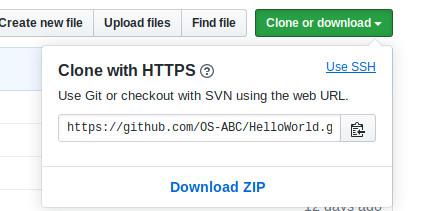
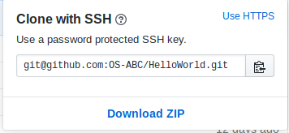

该文档将引导你快速在本项目中提交一个PR


[TOC]


---

## 安装Git

### Windows

在链接 https://git-scm.com/downloads 下载git并安装, 安装过程中记得要勾选git bash工具, 默认编辑器推荐使用vscode

### MacOS

一般在mac中是自带git的, 若无git, 则可通过包管理器homebrew安装git, 具体见MacOS系统使用指引章节(TODO)

### linux

linux各发行版一般是自带git的, 若无git, 则用各发行版特定的包管理器安装, 具体见linux各发行版使用指引章节(TODO)

## 创建一个github账户

使用邮箱注册https://github.com/

## 在本机上设置邮箱和用户名

git bash中执行
```
# 设置github账户名
git config --global user.name "js00070"

# 设置github注册时的邮箱
git config --global user.email "909645105@qq.com"

```

## 配置SSH key

git bash中执行

```

ssh-keygen -t rsa -C “909645105@qq.com”
# 按回车均采取默认配置

cd ~/.ssh
cat id_rsa.pub
# 复制公钥内容

```

打开github设置秘钥的界面 https://github.com/settings/keys

点击"New SSH key", 将公钥内容粘贴进去, 标题自己起一个. 之后就可以使用ssh进行clone/pull/push等操作了, 省去了繁琐的账号密码输入流程.






## 检出仓库
    1、将原仓库fork一份到自己账号下
	2、打开命令行窗口，输入 git clone 复制的地址(使用ssh地址)
	3、git命令执行结束后，在当前目录下出现了github上的工程项目源码

## 修改内容
    1. 创建并切换分支

    ```bash
    git status # 查看当前git仓库状态, 确认处于master分支中

    git branch pr-test # 从master分支分出为pr-test的分支

    git checkout pr-test # 切换至pr-test分支

    ```

    2. 修改内容
    使用任何自己喜欢用的编辑器/IDE修改内容
    
    3. add commit push

    ```bash
    git status # 查看当前做了哪些修改

    git add . # . 表示当前目录 git add . 是把当前目录的所有修改添加到暂存区里

    git status # 确认下修改

    git commit -m 'this is a commit' # 输入commit信息, 简要概括下本次修改

    git log # 查看commit历史

    git push # 提交到自己的远程仓库

    ```

## 提交PR

到github自己的仓库主页, 发现会有一个`Compare&Pull Request`选项, 点击即可提交PR


更多git使用方法详见git章节(TODO)


